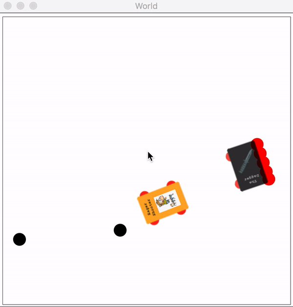

# Dodgeball World



Welcome to Dodgeball World! This is the first ever Virtual Robotics
1-vs-1 competition!  Here you will be tasked with creating a robot
that can shoot balls at your opponent, better than your opponent can
shoot them at you.

## The Game

There are two players, each with an assigned color of either red or
green.  The goal of the game is to knock out your opponent by shooting
balls at them.

You start out carrying a few balls, and you can recover balls by
picking up *neutral* balls.  A ball becomes neutral around 50 ticks
after it's fired.  Balls change their color from the color of their
contestant (red or green) to black when they become neutral.

Each time someone is hit by a ball of the opponent's color, they lose
a life (and their image fades a bit), and they're immediately
teleported to a different part of the arena.

Balls are shot out of the front of your car, and after every shot, you
enter a *cooldown period* which lasts for 20 ticks, during which you
can't shoot again.

You'll start either in the bottom left or top right, though there is a
little randomness in the starting position.

## Functions you know and love

The controls are almost the same as the last competition: your bot has
left and right motors that you can control independently.  Indeed,
there are a bunch of functions that you already know that still work
in this new game.

### Motor control

The left and right motors on your car determine the force on that side
of the car.  The power to each motor ranges from -1 (maximum push in
the reverse direction) to 1 (maximum push forward).

- `(set-motors! n1 n2)` sets the force being put into each side of the
  robot, ranging from -1 to 1.  Numbers beyond that range have no
  extra effect, so `(set-motors! -10 5)` does the same thing as
  `(set-motors! -1 1)`.

- `(change-motor-inputs n1 n2)` changes the force being put into each
  motor by the give amount.  For example: if the motors were already
  set to `(0.6, 0.3)`, then calling `(change-motor-inputs -0.1 0.4)`
  will leave them set to `(0.5, 0.7)`

- `(get-left%)`, `(get-right%)` gets the input (i.e.: force) to the
  left or right motors

### Sensors

These let you measure things about the world and about yourself, like
how much space there is ahead of you in a particular direction, and
what angle you're turned out.

Note that angles are by default in degrees, but there's now a function
to switch everything to radians, which is documented in the section on
new functions.

- `(get-looking-dist angle)` sees how far you can look in the
  direction of the given angle until there is an object, which could
  be a ball, wall or another robot. It is measured from the center of
  the robot, so 0 means directly forward, and positive angles are to
  the left.

- `(get-lookahead-dist)` and `(get-lookbehind-dist)` are the same as
  get-looking-dist except they are measured from the front and back of
  the robot respectively, and obviously the angles are always 0 and
  180 degrees respectively

- `(get-vl)`, `(get-vr)` gets the speed (in pixels per tick) of the
  left and right wheel of your robot.

- `(get-robot-angle)` get's the total amount that your robot has
  turned.  This is a tricky one.  When it's at zero, it means you're
  pointing exactly to the right.  When you turn your car to the left,
  it goes up, and when you go to the right it goes down.  But it's not
  bounded, meaning if you turn to the right for two full circles, your
  robot angle will be 720!  This can be a little confusing, but makes
  it easier to compute how fast you're turning by comparing previous
  readings of this sensor to the current one.

### Utility functions

- `(normalize-angle angle)` takes an angle outside of the range [-180,
  180) and returns the corresponding angle in that range

## New functions

These functions let you access the new functionality that's specific
to this game

- `(shoot)` shoots a ball forward. The speed is effected by the speed
  of your robot

- `(angles-to-neutral-balls)` returns a list of the angles to all the
  neutral balls (neutral balls = balls you can pick up) if a ball is
  straight ahead, it will say 0.

- `(get-cooldown-time)` returns how many ticks until you can shoot
  again. 0 if you can shoot now. run `(level-diffs)` to see average
  cooldown periods.

- `(num-balls-left)` returns the number of balls you have left

- `(front-left-close?)`, `(front-right-close?)`, `(back-left-close?)`,
  `(back-right-close?)` tells you if any given corner is very close
  (within 15 ticks) of a wall

- `(angle-to-other-bot)` returns the angle to the other bot. Leftwards
  is positive.  If you are facing the other robot, this function will
  return 0.  If it is directly behind you, it will return -180. If you
  would have to turn a little left to be facing it the number would be
  a small positive. Another way to think about what this function
  does, is say how much left you have to turn to be facing the other
  bot.

- `(get-other-robot-angle)`, which is like `(get-robot-angle)`, but it
  gives the answer for the opposing bot.

- `(dist-to-other-bot)` returns the distance in pixels to the other
  robot

- `(other-bot-shooting?)` tells you if the other bot shot last tick

- `(other-bot-level)` returns the level of the other robot. Possible
  values are: `'normal`, `'advanced` and `'expert`

- `(get-ball-vi)` returns the speed at which a ball is launched relative
  to the robot that shoots it

- `(set-degree-mode)`, `(set-radian-mode)` makes it so that all of
  your angles (both that you give to get from functions) are in the
  mode that you choose. Make sure to write this in on-tick. When using
  degrees angles go from 0 to 360.  With radians, they go from 0 to
  2π.

- `(robot-width)`, `(robot-length)` returns, in pixels, the width
  and length of your car respectively. Length refers to the longer
  side, and width the shorter.

## Advanced levels

Are you a computer science god?  Do you think you're too cool for
"normal" mode?  Then try out advanced mode!  You can do it by
commenting-out the first of these lines, and uncommenting the second.

```racket
(require "../../lib/worlds/dodgeball-world/dodgeball-world.rkt")
;(require "../../lib/worlds/dodgeball-world/dodgeball--advanced.rkt")
```

Run the function `(level-diffs)` to see how the levels differ from
each other.

## Technical details

You are hit by a ball if the bounding box of your robot intersects the
bounding box of the ball. Note: if the ball is completely inside of
your robot, you can neither pick it up nor be hit by it, until it hits
the edge.

The canvas is 450 by 450 units.
